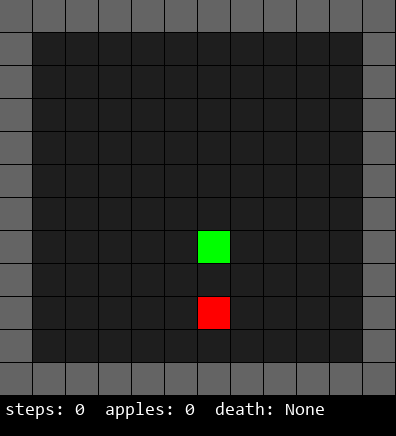
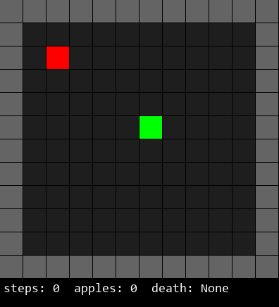
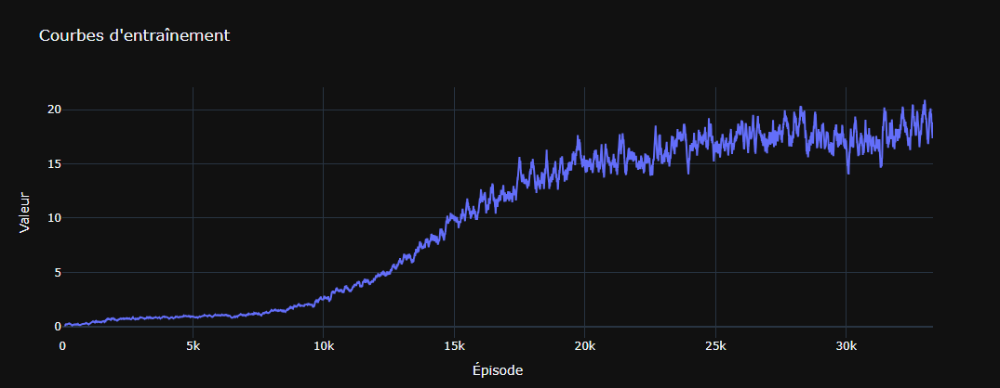

# Snake-RL

Reinforcement learning agent trained to play a custom snake game, using **CNN** and **DQN**.  


  
*Scores : 33 and 27 respectively*  

## Why this project

This was my first hands-on project in reinforcement learning. Although I already had some experience in AI, RL was a domain I hadn't really explored before. Building everything from scratch, from the environment and reward system to the agent and visual testing tools, helped me deeply understand the key components of RL:

- the impact of reward shaping on learning behavior
- the importance of temporal context (via stacked states)
- the importance of a good environement
- the time and computing power constraints of training the model
- and how to debug learning dynamics through logs and visualization

It was also a great opportunity to structure a full pipeline: training, logging, model saving/loading, interactive testing and visual debugging.

This project served as a foundation for exploring more complex RL environments and agents later on.

While I know there are more advanced techniques in use today than the classic CNN + DQN combo, I wanted to see how far I could push this baseline and really understand its strengths and limitations.

## Project structure

```
.
├── Agent.py                # dqn agent with replay buffer
├── SnakeEnv.py             # gym-like snake environment
├── DQN_model.py            # cnn model definition
├── train.py                # training loop
├── utils.py                # model loading/saving utilities
├── pygame_display.py       # pygame visualisation interface
├── main.py                 # entry point to run visual testing
├── logs/                   # training logs (csv)
├── models/                 # saved checkpoints (.pth)
├── plotly_log_viewer.py    # creates a web display of specified log csv file
└── README.md
```

## Training

Run training loop:

```bash
python train.py
```

Logs will be saved in `logs/` and checkpoint(s) in `models/` every 1000 episodes.

## Model

By default, the agent uses:

- 4-frame stacked input
- convolutional network (2 conv + 2 fc)
- epsilon-greedy policy
- reward shaping (apple, death, directional)

## Visual testing of a model

Run the pygame interface to watch the included demo agent play:

```bash
python main.py
```

or call directly:

```python
from pygame_display import run_pygame_visual
run_pygame_visual("models/model_name.pth", fps=5)
```

## Dependencies

- torch (install via [https://pytorch.org/get-started/locally/](https://pytorch.org/get-started/locally/))
- numpy
- pandas
- seaborn
- plotly
- dash
- pygame
- imageio

Install everything:

```bash
pip install -r requirements.txt
```

## Log viewer (optional and far from perfect, just a tool :) )

Launch the dashboard:

```bash
python plotly_log_viewer.py
```
  
*Apples eaten (score) per episode. Rolling average on 100 episodes. ~5 hours training.*

## Notes

- the environment is self-contained and does not rely on OpenAI Gym
- state representation is a 2D grid with values: 0 (empty), 1 (body), 2 (apple), 3 (wall), 4 (head)
- training includes optional reward shaping for guiding the snake toward apples
- the pygame rendering loop can be used interactively or to record gifs of the agent's performance

<hr>

## Details by component

### SnakeEnv.py

A custom grid-based Snake environment built without external dependencies. It mimics the interface of OpenAI Gym (step, reset, render).

Key features:

- Configurable grid size (default 10x10 + walls)
- Snake state encoded as a 2D numpy array
- Step-by-step progression for compatibility with RL training in a Gym return style
- Reward shaping: large positive reward for eating an apple, negative for dying, small positive/negative for moving toward/away from the apple
- Optional display using `render()` for terminal view or via `pygame_display.py`

### Agent.py

The agent implements a basic DQN with:

- Experience replay (using `deque`)
- Epsilon-greedy exploration
- Frame stacking (4 most recent states)
- PyTorch training loop with SmoothL1Loss (a more robust alternative to MSE, less exploding values)

Adjustable hyperparameters:

- `gamma`: discount factor (default 0.99)
- `epsilon_start`, `epsilon_end`, `epsilon_decay`: exploration schedule. `epsilon_end` must be very small (<=0.0001), otherwise there is too much random action and causes the death of the snake
- `memory_size`: buffer size (default 10,000)
- `batch_size`: minibatch size (default 64)

Training runs on GPU if available (CUDA), and automatically falls back to CPU if not.

### DQN_model.py

A simple convolutional network:

- Input: shape (4, H, W) — 4 stacked frames of the state
- Layers: 2 Conv2D + ReLU + Flatten + 2 Linear
- Output: one Q-value per possible action (up, down, left, right)

### train.py

Responsible for:

- Looping over episodes
- Resetting the environment
- Running the agent with stacked states
- Storing transitions and training the model
- Logging episode metrics (reward, loss, q-values, steps, death reason)
- Saving model checkpoints periodically

### pygame_display.py

Visual interface to:

- Watch the agent play in real time
- Display game stats (apples, steps, cause of death)
- Optionally record the game as GIFs

GIFs are saved in `outputs/` with filenames sorted by score and timestamp.

### utils.py

Uutilities to:

- Load model weights or full checkpoints
- Save models with replay buffer and epsilon
- Run a visual test in console